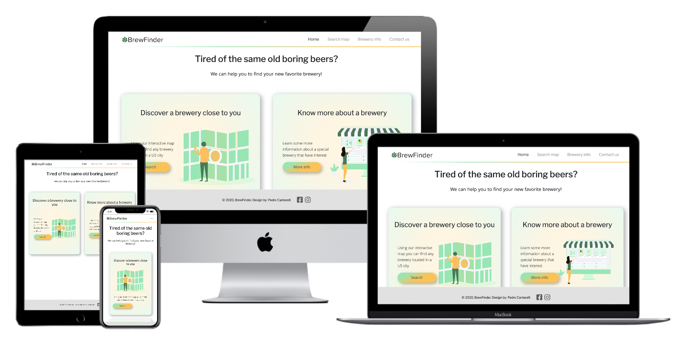
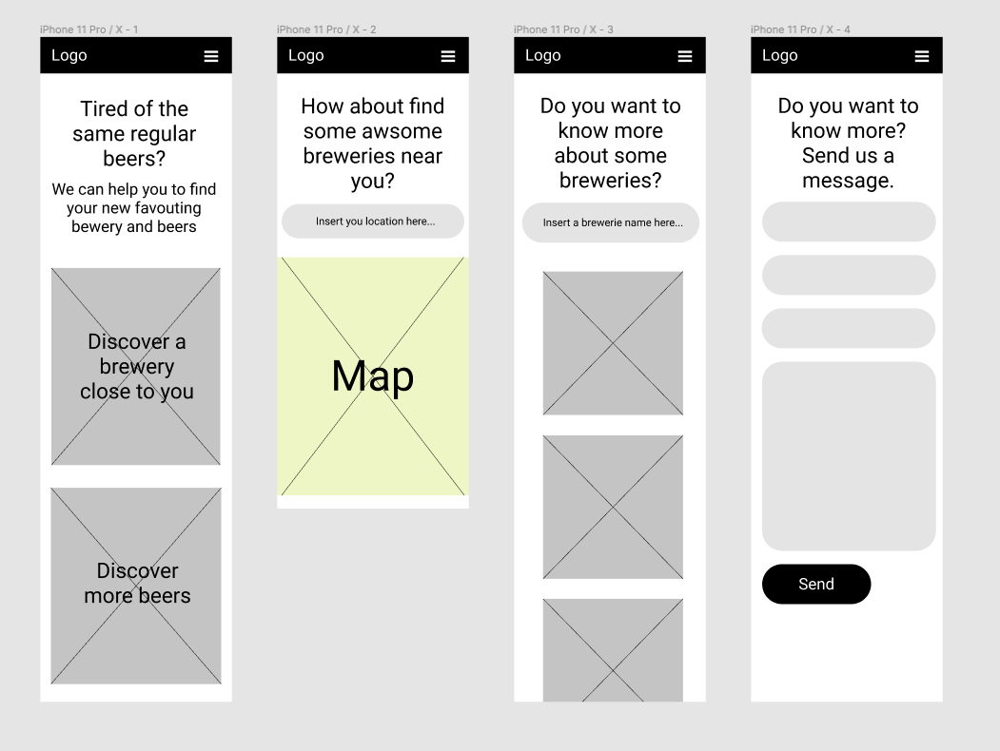

# **BrewFinder Website**
 
## **Interactive Frontend Development Project - Code Institute**
 
&nbsp;

 
BrewFinder is a website with a focus on promoting unknown breweries in the United States. The idea is that an organization of small breweries came together, and decided to create a website as a platform to promote their companies, especially where they are located and some basic information so who can access the BrewFind can get in touch with them.
 
This project is part one of the four milestone projects of the Code Institute Full Stack Developer course and aims to show an interactive website using only HTML5, CCS3, and Javascript. A big part of this project is the use of APIs, such as Google Maps and Open BreweryDB to get the necessary information to make this project functional.
 
Access the website here: [BrewFinder](https://pcantarelli.github.io/interactive-FED-project/)
 
&nbsp;
 
## **Table Of Contents**
 
* [User Experience](#user-experience-(ux))
* [Design Process](#design-process)
* [Features](#features)
* [Technologies Used](#technologies-used)
* [Testing](#testing)
* [Deployment](#deployment)
* [Credits](#credits)
* [Acknowledgments](#acknowledgments)
 
&nbsp;
 
## **User Experience (UX)**
 
### **Project Goals:**
 
* Promote unknown breweries by letting them easily searchable.
* Help people to find new breweries by search locations (cities) in the United State
* Make it possible for people to find information about breweries even if you just remember part of their name.
* Provide some basic information about those breweries to people, so they can locate them and get the necessary information to get in touch.
 
* Have a contact form where people can contact the website management for information and business purposes.
 
### **User Stories**
 
#### **New Users:**
 
* I'm a beer enthusiast and would like to know some breweries in my city
* I'm traveling in the U.S. and would like to find some new breweries in the locations I'll pass by.
* After drinking a new kind of beer that I didn't know before, I'd like to find some information about this brewery.
* A beer festival organizer would like to find some local breweries for a partnership.
 
#### **Returning User:**
 
* After visiting some local breweries that I found on BrewFinder, I'm pretending to plan a trip to another U.S. city and would like to know their local breweries.
* I'd like to find some information to get in touch with a brewery that I discover on BrewFinder.
 
#### **Business Owner:**
 
* I want to promote the breweries that are part of my organization in the U.S.
* I'd like to make it possible to find the breweries by their location or their name (even part of it), and initially promote their basic contact information.
* I need a contact form where people can contact us if they need some information or have a business proposal.
 
## **Design Process**
 
### **Strategy Plane:**
 
The main objective of this website is to make it easier for people to find one or more breweries by their location or their name. For that, we created two separate pages, one where you can search breweries by their location on a map, and another one where you can search by their name. Those two pages are the pillar of this project, and where we are trying to attract the users focus.

### **Scope Plane:**
 
The key features that this project aims to attend are:
 
* Anyone can easily access the website using any device and have a smooth navigation to find the information they are looking for.
* You can search any place in the U.S. and find some breweries, and if it is not possible, let it clear to the user that no information was found for that location.
* Make it possible to find information about a brewery even if you just remember part of its name
* Promote the brewery's contact information, so the user can get in touch with them or find their address for a visit.
* Provided a simple way to contact the website management through a contact form connected to an email message.
 
### **Skeleton Plane:**
 
When the wireframe of this project was created, it was decided to have a simple and straightforward website, showing in the main pages the possible ways to search a brewery. The search pages were designed to be clean and provide the information clearly.
 
The layout of the wireframe was designed using Figma, as a starting point of how to display the project goal in a simple and direct format, in any kind of device.
 
It was decided to use the **Google Maps API** to display the search map as it is the most robust and customizable solution. To retrieve the breweries' information this project uses the **Open BreweryDB API** as it was the most reliable option for this project. To receive the messages sent on the Contact us page, it is used the **EmailJS API** which sends the message to the website manager.
 
### **Wireframes:**
 
The project wireframes can be accessed [clicking here](XXXXXXXX).
 
Mobile:
 

 
Desktop / Tablet:
 
.
 
### **Surface Plane:**
 
As the project aims to have a modern look and feel, it was decided to use some components largely used in the Front End web design nowadays, such as: Gradient colors, Vector designs, Cards, and others.
 
The project color scheme was created on [Coolors](https://coolors.co/) and aims to have a vibrant feeling that stands out and gets the user's attention, especially on the call to action points.
 

 
The typography used aimed to have complementary fonts, that are similar but distinct enough to create some contrast. The fonts used are the **Libre Franklin** and **Khula** imported from Google Fonts, and in case they can't be loaded, the fall back is Sans Serif as it will always be loaded correctly.
 
The images used are from [Free Web Illustrations](https://freewebillustrations.com/delesign-free-designs-remote-team/) and were customized to fit the project color scheme and design. They are used as a visual reference for the search pages and to have a modern look and feel.
 
The project layout is strategically simple, to maintain the user focus on the experience the website wants to provide. All pages can be easily accessed by a common Header Navigation menu on all pages, and it was decided that there was no need for a Footer at the moment.
 
The homepage has two cards that stand out to inform the user how the website can be used, and have an attractive call to action buttons. The search pages aim to provide a good user experience and display the information searched in a simple and direct format.
 
The Search map page uses the Open BreweryDB API to find all breweries' latitude and longitude in the area searched, and the Google Maps API is used to display the breweries found on that location though some Pins are added to the Map.
 
The Search info pages use the Open BreweryDB API to retrieve the breweries' information found that matches with the term searched. Then a javascript code is used to insert that information through cards on this page.
 
## **Features**
 
All project features can be accessed at any time through the Header Navigation menu that is common to all pages.
 
### **Consistent features across all pages:**
 
* A header with the website logo and name, with a responsive navigation menu that depending on the screen size can shrink to be displayed through a hamburger menu.
 
### **Home:**
 
* Two cards that inform what can be done in the website, and attract the user's attention to its call to action button, so the main project pages are accessed.
 
### **Search Map:**
 
* A large title is displayed suggesting the user to search a location, letting clear that **needs to be in the United States**. 
> **Atention: due to the API limitations, at the moment is not possible to retrieve any information from cities not located in the U.S**
* The input field informs through a placeholder where the search term needs to be inserted, and clear that it **needs to be a city**.
> **Atention: due to the API limitations, the location needs to be a City name (State or any other kinf of location wont work properly)**
* A map where the breweries' location information retrieved using the search term is displayed through Pins.
 
### **Brewery info:**
 
* A large title is displayed suggesting the user to search a brewery and know more about it.
* The input field informs through a placeholder that the search names **needs to be a brewery name**.
* It is also displayed a card informing that any part of the brewery name can be searched and that some brewery information can be not found (that's is a known limitation of the Open BreweryDB API, and as a result a limitation of this project at the moment)
* All the information retrieved on the Open BreweryDB API using the searched term is displayed on the cards.
 
### **Contact us:**
 
* A form is provided where the used basic information (Name and Email) are collected, letting it be possible to easily send a message to the website manager. By using the EmailJS API, this message is sent to the website manager.
 
### **Features I could implement in the future:**
 
* It Is possible to search any location, not only a city and not only in the United States.
* Display more breweries information, like the beers produced and some individual visual representation (like a logo or product image)
 
## **Technologies Used**
 
### **Languages, libraries, frameworks, editors, and version control**
 
* HTML5 - To create and add content to the website.
* CSS3 - To style the website content and provide responsiveness.
* JavaScript - Used to get the terms searched and through the APIs utilized in this project find the breweries information and display it to the user.
* [Bootstrap](https://getbootstrap.com/) - This framework was used on the website Header and Navigation menu.
* [VS Code](https://code.visualstudio.com/) - The development tool used to write the website code
* [GitHub](https://github.com/) - Used for version control, host files and deploy website.
 
### APIs**
 
* [Google Maps Platform](https://developers.google.com/maps/documentation) - Used to display the map and the breweries' locations.
* [Open Brewery DB](https://www.openbrewerydb.org/) - Used to get all breweries information necessary for this project.
* [EmailJS](https://www.emailjs.com/) - Used to get the information sent on the website contact form and send it to the website manager.
 
### **Other Tools Used**
 
* [Figma](https://figma.com/) - To create website wireframes.
* [Free Web Illustrations](https://freewebillustrations.com/delesign-free-designs-remote-team/) - Images
* [Google Fonts](https://fonts.google.com/) - Primary website font
* [Logo Maker](https://logomakr.com/)- Used to create the website logo
* [Font Awesome](https://fontawesome.com/) - Icons on Events and Riders page.
* [Coolors](https://coolors.co/) - Color palette
 
### **Educational Resources**
 
* [CSS Tricks](http://css-tricks.com/) - Mainly used as a resource to help with Flexbox positioning
* [Stack Overflow](https://stackoverflow.com/) - Used to find the reason for some errors found during the website development.
 
//Continuar daqui
 
## **Testing**
 
### **Testing User Stories:**
 
* New user:
   * I'm a beer enthusiast, visiting Atlanta for the weekend and pretending to visit some local breweries, so I access Brew Finder to check where they are located and to find their website. On the homepage, the user finds a navigation menu where he can access any page, and two cards promoting the website functionalities (Search Map and Breweries Info ). The footer contains the development information and social links. In the case of this user, the Search Map functionality will help him to plan his trip.
 
* Returning user:
   * I visited Oakland a few weeks ago and visited a brewery that I really loved, but forgot their name. Just remember that they have the word "Dog" in their name. I remember that Brew Finder has a functionality to search a brewery by its name, so access it again to find the information of this specific brewery again.
 
* Business owner:
   * The website is working as intended, easily providing the direction to the users to find the information we provide. The contact form works perfectly, and I get all the messages sent through the form on the Contact page.
 
### **Validating The Code:**
 
* All HTML files validated with [W3C Markup Validation Service](https://validator.w3.org/) - No Errors Found
* CSS file validated with [W3C CSS Validation Service](https://jigsaw.w3.org/css-validator/) - No Errors Found
* All JavaScript files validated with [Esprima Syntax Validator](https://esprima.org/demo/validate.html) - No Errors Found
 
### **Browsers testing**
 
Website tested on the following browsers manually, no error found
 
* Chrome
* Safari
* Mozilla Firefox
* Microsoft Edge
 
### **Responsiveness testing**
 
Website tested on the following devices manually or using Chrome Developer Tools, no error found
 
* iPhone X
* Ipad Pro
* Google Pixel
* Macbook Pro 16”
* Desktop Monitor Philips 25”
 
## **Deployment**
 
The code of this project was written using [Gitpod](https://www.gitpod.io/) and deployed and hosted on [GitHub Pages](https://pages.github.com/), following the below steps:
 
1. Opened [GitHub](https://github.com/) page and signed in
2. Accessed the repository [interactive-FED-project](https://github.com/pcantarelli/interactive-FED-project)
3. Go to **Settings**
4. On the GitHub Pages sections selected on the dropdown menu **'Master Branch' > '/root'**
5. Clicked on **Save**
6. Website is live now [here GitHub Pages](https://pcantarelli.github.io/interactive-FED-project/)
 
#### **Deploy your version of this project**
 
1. Be sure to have GIT instaççed
2. Clone [this repository](https://github.com/pcantarelli/interactive-FED-project)
3. Follow the steps above to deploy your project on GitHub Pages
 
## **Credits**
 
### **Content**
 
This website was developed using the Code Institute project template that can be found on [this repository](https://github.com/Code-Institute-Org/gitpod-full-template).
 
The Read.me file was based on Code Institute [readme-template](https://github.com/Code-Institute-Solutions/readme-template) and the [README.md](hhttps://github.com/pcantarelli/user-centric-FED-project/blob/master/README.md) file of my last project.
 
The base code from the sections: [Header navbar](https://getbootstrap.com/docs/4.5/components/navbar/), and [Contact form](https://getbootstrap.com/docs/4.5/components/forms/) were based on the linked documentation from Bootstrap.
 
### **Media**
 
All images were taken online on the [Free Web Illustrations](https://freewebillustrations.com/delesign-free-designs-remote-team/) website. Really appreciated that support.
 
### **Acknowledgments**
 
I’d like to thank the Code Institute tutors and support staff. Their help definitely helped me to achieve all my goals on this project.
 
Thanks to Mark Railton and Aaron Sinnott, my mentors, that also supported me during this project.
 

